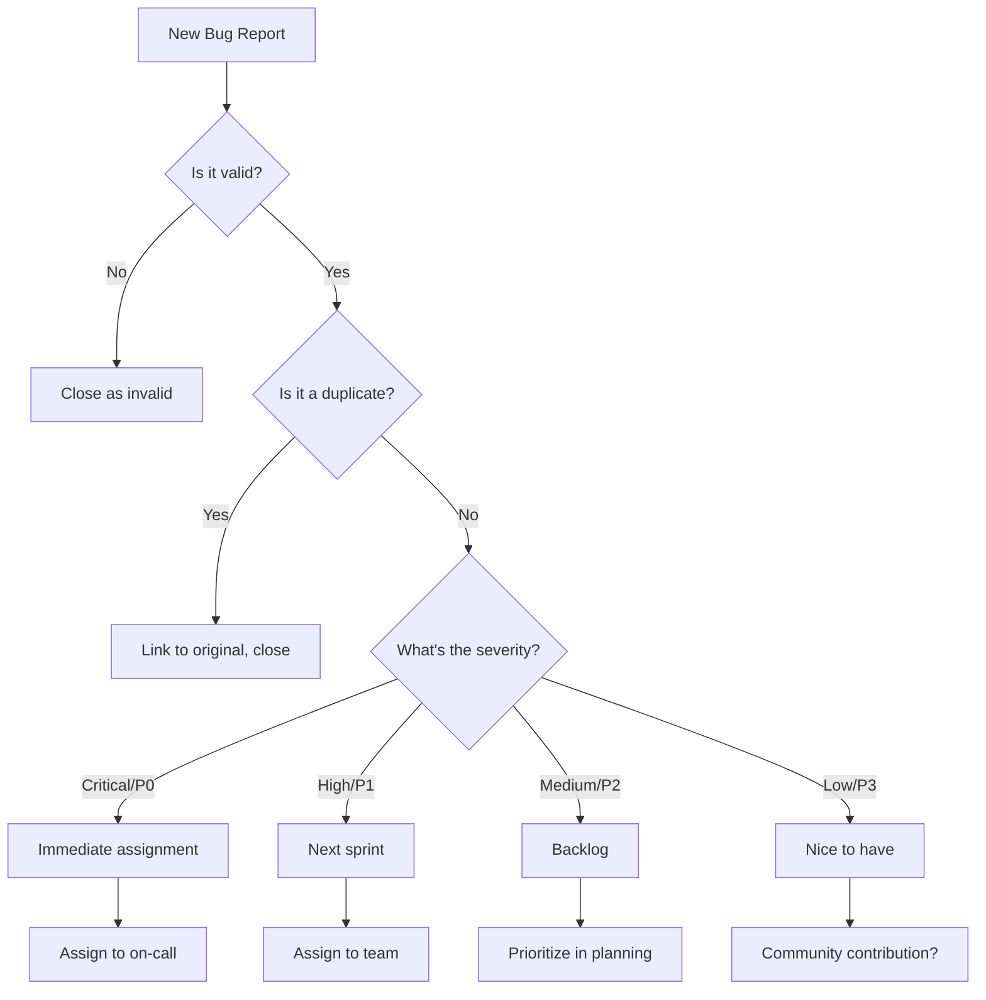

## Overview

Bug triage is the process of analyzing, prioritizing, and routing bug reports to the right team members. Righthands quickly understand issues, find root causes, and determine the best course of action.

## Core Capabilities

### Bug Analysis

<CardGroup cols={2}>
  <Card title="Root Cause Analysis" icon="magnifying-glass">
    Analyze stack traces and logs to identify likely causes
  </Card>
  <Card title="Similar Issues" icon="clone">
    Find related bugs and previous fixes
  </Card>
  <Card title="Impact Assessment" icon="triangle-exclamation">
    Evaluate severity and user impact
  </Card>
  <Card title="Reproduction Steps" icon="list-ol">
    Generate clear steps to reproduce the issue
  </Card>
</CardGroup>

### Automated Triage

<Steps>
  <Step title="Initial Analysis">
    Parses bug report, extracts key information, and analyzes error logs
  </Step>
  <Step title="Categorization">
    Classifies by type (crash, data corruption, UI issue, performance, etc.)
  </Step>
  <Step title="Priority Assessment">
    Evaluates severity, affected users, and business impact
  </Step>
  <Step title="Team Assignment">
    Suggests appropriate team or developer based on code ownership
  </Step>
</Steps>

## Common Use Cases

### Stack Trace Analysis

<CodeGroup>
```text Bug Report
Application crashes when users try to export large reports (>10k rows).

Stack trace:
  at ReportGenerator.generateCSV (report.js:156)
  at ReportExporter.export (exporter.js:45)
  at AsyncFunction.handleExportClick (ui/reports.js:234)
  Error: JavaScript heap out of memory
```

```text Righthand Analysis
BUG ANALYSIS COMPLETE

ROOT CAUSE:
Memory exhaustion during CSV generation for large datasets

TECHNICAL DETAILS:
- Error occurs at report.js:156 in generateCSV method
- Application attempting to load entire dataset into memory
- Node.js heap limit exceeded (~2GB)

SIMILAR ISSUES:
- Issue #456: CSV export crash (fixed 6 months ago with streaming)
- Issue #789: Memory issues with large datasets (ongoing)

LIKELY CAUSE:
The generateCSV function builds entire CSV string in memory before writing.
For 10k+ rows with many columns, this exceeds heap limit.

RECOMMENDED FIX:
Implement streaming CSV generation (similar to fix in #456):
1. Use stream-based CSV library (e.g., fast-csv)
2. Write rows incrementally instead of building full string
3. Add progress indicator for user feedback

AFFECTED CODE:
- report.js:145-170 (generateCSV method)
- exporter.js:40-52 (export method)

PRIORITY: High
- Blocking users from core functionality
- Affects enterprise customers with large datasets
- Workaround: Manual data segmentation (poor UX)

ESTIMATED EFFORT: 3-5 hours
```
</CodeGroup>

### Duplicate Detection

Righthand can identify duplicate bug reports:

<Tip>
When a new bug is reported, ask: "Is this a duplicate of an existing issue?"
</Tip>

Righthand analyzes:
- Error messages and stack traces
- Symptoms and reproduction steps
- Affected components and versions
- User-reported behaviors

### Reproduction Step Generation

Convert vague bug reports into clear reproduction steps:

<AccordionGroup>
  <Accordion title="Before: Vague Report">
    "The app is slow sometimes when I click on things"
  </Accordion>
  <Accordion title="After: Clear Steps">
    Based on logs and similar reports, reproduction steps:

    1. Log in as a user with 1000+ items in their account
    2. Navigate to Dashboard page
    3. Click on "View All Items" button
    4. Observe: Page takes 15-20 seconds to load (expected: less than 2 seconds)
    5. Environment: Production, Chrome 120, Windows 11
    6. Frequency: Consistently reproducible for users with >1000 items
  </Accordion>
</AccordionGroup>

### Priority Assessment

<Steps>
  <Step title="Severity Analysis">
    Crash/data loss (Critical) vs. Cosmetic issue (Low)
  </Step>
  <Step title="User Impact">
    How many users affected? Is there a workaround?
  </Step>
  <Step title="Business Impact">
    Revenue impact, customer complaints, SLA violations
  </Step>
  <Step title="Final Priority">
    P0 (drop everything), P1 (next sprint), P2 (backlog), P3 (nice-to-have)
  </Step>
</Steps>

## Advanced Features

### Log Analysis

Righthand can parse and analyze various log formats:

```text Example Request
"Analyze the error logs from production between 2pm and 3pm yesterday"
```

Righthand provides:
- Error frequency and patterns
- Correlation between errors
- Timeline of events leading to failures
- Affected services and dependencies
- Suggested investigation starting points

### Root Cause Investigation

<CardGroup cols={2}>
  <Card title="Code History" icon="clock-rotate-left">
    When was the problematic code last changed?
  </Card>
  <Card title="Recent Deployments" icon="rocket">
    Was this introduced in a recent release?
  </Card>
  <Card title="Related Changes" icon="code-branch">
    What else changed in nearby code?
  </Card>
  <Card title="Test Coverage" icon="vial">
    Are there tests covering this scenario?
  </Card>
</CardGroup>

### Impact Estimation

Quantify bug impact for better prioritization:

| Impact Factor | Analysis |
|---------------|----------|
| Users Affected | How many users hit this bug? |
| Frequency | How often does it occur? |
| Severity | Data loss, crash, or minor issue? |
| Revenue Impact | Lost sales or cancellations? |
| Support Load | Volume of support tickets? |
| Workaround | Is there a viable workaround? |

### Automated Bug Routing

Assign bugs to the right team or person:

<Steps>
  <Step title="Code Ownership">
    Identify who owns the affected code files
  </Step>
  <Step title="Expertise Matching">
    Match issue type to developer expertise
  </Step>
  <Step title="Workload Balancing">
    Consider current workload and availability
  </Step>
  <Step title="Similar Issue History">
    Who fixed similar issues before?
  </Step>
</Steps>

## Best Practices

### Efficient Triage Process

<AccordionGroup>
  <Accordion title="Daily Triage Session">
    Review new bugs daily with Righthand's automated analysis
  </Accordion>
  <Accordion title="Priority First">
    Always triage critical bugs immediately, batch lower priority
  </Accordion>
  <Accordion title="Complete Information">
    Ensure bug reports have all necessary information before assignment
  </Accordion>
  <Accordion title="Clear Ownership">
    Assign every bug to a specific person or team
  </Accordion>
</AccordionGroup>

### Bug Report Quality

Righthand can help improve bug report quality:

- **Missing Information**: Flag reports lacking reproduction steps, logs, or environment details
- **Unclear Descriptions**: Rewrite vague descriptions more clearly
- **Screenshot Analysis**: Extract information from attached screenshots
- **Video Analysis**: Summarize screen recordings of issues

### Triage Metrics

Track triage effectiveness:

```text Example Queries
"How long does it take on average to triage a bug?"
"What percentage of bugs are P0 vs P1 vs P2?"
"Who are our fastest bug resolvers?"
"What types of bugs take longest to fix?"
```

## Integration with Development Workflow

### Jira/Linear/GitHub Issues

<Steps>
  <Step title="Automated Analysis">
    When new issue created, Righthand automatically analyzes it
  </Step>
  <Step title="Add Context">
    Comments added with analysis, similar issues, and recommendations
  </Step>
  <Step title="Suggest Labels">
    Auto-suggest labels for component, severity, type
  </Step>
  <Step title="Assign Owner">
    Recommend assignee based on code ownership
  </Step>
</Steps>

### Monitoring Integration

Connect bug triage to monitoring tools:

<CardGroup cols={2}>
  <Card title="Error Tracking" icon="circle-exclamation">
    Sentry, Rollbar, Bugsnag integration
  </Card>
  <Card title="Log Aggregation" icon="database">
    Splunk, Datadog, CloudWatch analysis
  </Card>
  <Card title="APM Tools" icon="chart-line">
    New Relic, AppDynamics correlation
  </Card>
  <Card title="User Analytics" icon="users">
    Connect user behavior to bug reports
  </Card>
</CardGroup>

### Communication Templates

Generate clear communication for stakeholders:

<Tabs>
  <Tab title="Customer Response">
    "Generate a customer-facing response for bug #1234"

    Righthand creates:
    - Acknowledgment of the issue
    - Explanation in non-technical terms
    - Expected timeline for fix
    - Available workarounds
    - Commitment to update when resolved
  </Tab>

  <Tab title="Internal Update">
    "Create status update for bug #1234"

    Righthand creates:
    - Technical summary
    - Investigation progress
    - Blockers or dependencies
    - ETA for resolution
    - Testing requirements
  </Tab>

  <Tab title="Postmortem">
    "Generate postmortem for bug #1234"

    Righthand creates:
    - What happened
    - Root cause
    - Why it wasn't caught earlier
    - How it was fixed
    - Prevention measures
  </Tab>
</Tabs>

## Example Workflows

<Accordion title="Morning Bug Triage">
**Scenario**: Daily bug triage for the engineering team

1. **Overnight Bugs** (8:00 AM)
   - "Show me all bugs reported overnight"
   - Righthand provides prioritized list with analysis

2. **Critical Issues First** (8:05 AM)
   - "Analyze the P0 issue #2341"
   - Righthand provides root cause analysis
   - Assign to on-call engineer immediately

3. **Batch Processing** (8:15 AM)
   - "Categorize and prioritize the remaining 12 bugs"
   - Review Righthand's priority suggestions
   - Assign to team members

4. **Similar Issue Check** (8:30 AM)
   - "Are any of today's bugs duplicates?"
   - Righthand identifies 3 duplicates
   - Close duplicates, consolidate information

5. **Status Update** (8:45 AM)
   - "Generate triage summary for the team"
   - Share in Slack: 1 P0, 3 P1, 8 P2 assigned
</Accordion>

<Accordion title="Production Incident Triage">
**Scenario**: Critical production issue reported

1. **Immediate Analysis** (T+0 minutes)
   - Production monitoring alerts on spike in errors
   - "Analyze production errors in the last 10 minutes"
   - Righthand identifies affected endpoint and error type

2. **Root Cause Investigation** (T+5 minutes)
   - "What changed recently in the payment processing service?"
   - Righthand identifies deployment 15 minutes ago
   - Shows specific commit that introduced the issue

3. **Impact Assessment** (T+10 minutes)
   - "How many users are affected?"
   - Righthand analyzes logs: 250 users, 1,500 failed transactions
   - Revenue impact: ~$45,000 in failed orders

4. **Solution Path** (T+15 minutes)
   - "Should we rollback or hot fix?"
   - Righthand recommends rollback (safer, faster)
   - Provides rollback command and verification steps

5. **Communication** (T+20 minutes)
   - "Generate incident update for customers"
   - Righthand drafts customer communication
   - Post to status page, social media

6. **Resolution** (T+45 minutes)
   - Rollback complete, monitoring shows recovery
   - "Generate postmortem outline"
   - Schedule postmortem meeting
</Accordion>

<Accordion title="Bug Fix Verification">
**Scenario**: Verify a bug fix is complete

1. "Check if bug #1234 fix addresses all reported issues"

2. Righthand verifies:
   - Original reproduction steps no longer reproduce issue
   - Similar edge cases are also fixed
   - Tests added to prevent regression
   - Documentation updated if needed

3. "Are there any other bugs similar to #1234 that might have the same root cause?"

4. Righthand finds 2 other bugs with similar patterns

5. "Create fix checklist for bugs #1235 and #1236"

6. Apply same fix to related issues
</Accordion>

## Bug Triage Decision Tree



## Related Use Cases

- [Code Review Assistance](/employee-types/software-developer/code-review-assistance) - Prevent bugs before they ship
- [Documentation Generation](/employee-types/software-developer/documentation-generation) - Document known issues and workarounds

<Info>
Set up Righthand to automatically analyze new bug reports as they come in, saving valuable triage time.
</Info>

<Warning>
Always verify Righthand's priority and impact assessments with your domain knowledge and business context before finalizing decisions.
</Warning>
