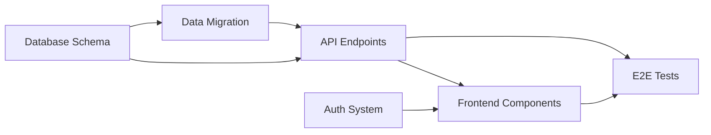

## Overview

Sprint planning sets the direction for development cycles. Righthands break down features, estimate effort accurately, plan capacity, and help create achievable sprint goals.

## Core Capabilities

### Story Breakdown

<CardGroup cols={2}>
  <Card title="Epic Decomposition" icon="sitemap">
    Break large features into manageable user stories
  </Card>
  <Card title="Task Creation" icon="list-check">
    Convert stories into specific technical tasks
  </Card>
  <Card title="Acceptance Criteria" icon="circle-check">
    Generate clear definition of done for each story
  </Card>
  <Card title="Dependency Mapping" icon="diagram-project">
    Identify dependencies between stories and tasks
  </Card>
</CardGroup>

### Effort Estimation

<Steps>
  <Step title="Analyze Complexity">
    Reviews code areas affected, technical challenges, and unknowns
  </Step>
  <Step title="Historical Comparison">
    Compares to similar stories completed in the past
  </Step>
  <Step title="Generate Estimates">
    Provides story point or time-based estimates
  </Step>
  <Step title="Confidence Level">
    Indicates certainty of estimates (high/medium/low confidence)
  </Step>
</Steps>

### Capacity Planning

<Steps>
  <Step title="Team Availability">
    Accounts for PTO, meetings, and non-development time
  </Step>
  <Step title="Velocity Analysis">
    Reviews historical velocity and trends
  </Step>
  <Step title="Commitment Calculation">
    Determines realistic sprint capacity
  </Step>
  <Step title="Buffer Planning">
    Includes buffer for unknowns and technical debt
  </Step>
</Steps>

## Common Use Cases

### Epic Breakdown

<CodeGroup>
```text Epic Description
"Implement user authentication system with OAuth support"
```

```text Righthand Story Breakdown
EPIC: User Authentication System

USER STORIES (Priority Order):

1. Basic Email/Password Authentication
   Story Points: 5
   Priority: Must Have
   - As a user, I can sign up with email and password
   - As a user, I can log in with my credentials
   - As a user, I can reset my password if forgotten

   Acceptance Criteria:
   - Email validation (RFC 5322 compliant)
   - Password requirements: 8+ chars, uppercase, lowercase, number
   - Password hashing with bcrypt (cost factor 12)
   - Email verification required before account activation
   - Rate limiting on login attempts (5 attempts per 15 minutes)

   Technical Tasks:
   - [ ] Create user schema and migration
   - [ ] Implement registration endpoint
   - [ ] Implement login endpoint with JWT
   - [ ] Build password reset flow with email
   - [ ] Add rate limiting middleware
   - [ ] Write unit tests for auth service
   - [ ] Write integration tests for auth endpoints

2. OAuth Provider Integration (Google)
   Story Points: 8
   Priority: Should Have
   Dependencies: Story #1
   - As a user, I can sign in with Google
   - As a user, my Google profile info pre-fills registration

   Acceptance Criteria:
   - OAuth 2.0 flow implementation
   - Google account linking to existing accounts
   - Profile picture and email imported from Google
   - Handle OAuth errors gracefully

   Technical Tasks:
   - [ ] Set up Google OAuth application
   - [ ] Implement OAuth callback handler
   - [ ] Build account linking logic
   - [ ] Handle edge cases (email conflicts, denied permissions)
   - [ ] Add OAuth flow tests

3. Session Management
   Story Points: 3
   Priority: Must Have
   Dependencies: Story #1
   - As a user, I stay logged in across browser sessions
   - As a user, I can log out from all devices

   [Additional stories continue...]

TOTAL ESTIMATED EFFORT: 34 Story Points
RECOMMENDED SPLIT: Sprint 1 (Stories 1,3), Sprint 2 (Stories 2,4,5)
```
</CodeGroup>

### Sprint Capacity Planning

<CodeGroup>
```text Team Information
Team: 5 developers
Sprint: 2 weeks (10 working days)
PTO: John (3 days), Sarah (2 days)
Recurring meetings: 6 hours/person/week
Average velocity: 42 story points
```

```text Righthand Capacity Analysis
SPRINT CAPACITY CALCULATION

AVAILABLE HOURS:
Total possible: 5 developers × 10 days × 8 hours = 400 hours

SCHEDULED ABSENCES:
- John PTO: 24 hours
- Sarah PTO: 16 hours
Subtotal: 360 hours

MEETINGS & OVERHEAD:
- Sprint ceremonies: 8 hours/person = 40 hours
- Recurring meetings: 6 hours/person/week × 2 weeks = 60 hours
- Code review: ~10% of dev time = 36 hours
- Slack/email/interruptions: ~15% = 54 hours
Subtotal: 190 hours available for development

CAPACITY BY DEVELOPER:
John: 32 hours (PTO adjusted)
Sarah: 36 hours (PTO adjusted)
Mike: 40 hours
Amy: 38 hours (covering Sarah 1 day)
David: 44 hours

VELOCITY-BASED CAPACITY:
Recent velocity: 40, 44, 42 (avg: 42 points)
Recommended commitment: 38-42 story points
With confidence buffer: 35-38 points

RECOMMENDATION:
- Commit to 38 story points
- Keep 2-3 smaller stories as stretch goals
- Reserve 15% capacity for technical debt
- Include 1 spike for OAuth investigation

RISK FACTORS:
- New technology (OAuth) may slow velocity
- Two team members out same day (Wednesday week 2)
- Holiday next Monday may affect focus
```
</CodeGroup>

### Story Refinement

Convert vague requirements into well-defined stories:

<AccordionGroup>
  <Accordion title="Before: Vague Requirement">
    "We need better performance on the dashboard"
  </Accordion>

  <Accordion title="After: Refined Stories">
    **Story 1: Optimize Dashboard Data Loading**
    - As a user, I want the dashboard to load in under 2 seconds
    - Currently: 8-12 seconds for users with lots of data
    - Target: less than 2 seconds for 95% of users

    Technical approach:
    - Implement data pagination (load 20 items at a time)
    - Add Redis caching for frequently accessed data
    - Lazy load charts below the fold

    Acceptance criteria:
    - Dashboard loads in less than 2s for users with fewer than 1000 items
    - Dashboard loads in less than 3s for users with fewer than 10,000 items
    - No functionality lost (all data still accessible)

    Story Points: 5

    **Story 2: Add Dashboard Loading Indicators**
    - As a user, I want to see loading progress so I know the app is working

    Acceptance criteria:
    - Skeleton screens for charts and tables
    - Progress indicator shows % loaded
    - Ability to interact with loaded sections while others load

    Story Points: 2
  </Accordion>
</AccordionGroup>

### Estimation Assistance

<Tip>
Ask: "Help me estimate this story: [story description]"
</Tip>

Righthand provides:

| Estimation Factor | Analysis |
|-------------------|----------|
| Complexity | Technical challenges, unknowns, learning curve |
| Scope | How many files/components affected |
| Dependencies | External APIs, team dependencies |
| Testing | Unit, integration, E2E test requirements |
| Historical Data | Similar stories and their actual effort |
| Risk Level | Likelihood of unexpected complications |

## Advanced Features

### Dependency Visualization

Righthand can map out story dependencies:



Ask: "What's the critical path for this sprint?" or "Which stories are blockers?"

### Risk Assessment

Identify risky stories that might derail the sprint:

<CardGroup cols={2}>
  <Card title="Technical Unknowns" icon="circle-question">
    Stories involving unfamiliar technology
  </Card>
  <Card title="External Dependencies" icon="link">
    Stories requiring third-party APIs or teams
  </Card>
  <Card title="Scope Creep Risk" icon="expand">
    Vague requirements likely to expand
  </Card>
  <Card title="Historical Issues" icon="triangle-exclamation">
    Similar stories that went poorly before
  </Card>
</CardGroup>

### Velocity Tracking

Analyze team velocity trends:

```text Example Queries
"What's our average velocity over the last 6 sprints?"
"Is our velocity trending up or down?"
"Which types of stories take longer than estimated?"
"How accurate are our estimates?"
```

### Sprint Simulation

<Steps>
  <Step title="Load Candidate Stories">
    Import all potential stories for the sprint
  </Step>
  <Step title="Apply Constraints">
    Team capacity, dependencies, priorities
  </Step>
  <Step title="Generate Scenarios">
    Multiple possible sprint plans
  </Step>
  <Step title="Compare Options">
    Evaluate trade-offs of each scenario
  </Step>
</Steps>

## Best Practices

### Effective Story Writing

<AccordionGroup>
  <Accordion title="User-Centric Format">
    Use "As a [user], I want [goal], so that [benefit]" format
  </Accordion>
  <Accordion title="Clear Acceptance Criteria">
    Define 3-5 specific, testable criteria for completion
  </Accordion>
  <Accordion title="Right-Sized Stories">
    Stories should be completable in 1-3 days
  </Accordion>
  <Accordion title="Include Technical Context">
    Note technical constraints, edge cases, and considerations
  </Accordion>
</AccordionGroup>

### Sprint Planning Meeting

<Steps>
  <Step title="Pre-Meeting Prep (Day Before)">
    - "Analyze and estimate all refined backlog items"
    - "Generate capacity calculation for next sprint"
    - "Identify any dependency conflicts"
  </Step>

  <Step title="Sprint Goal Setting (15 min)">
    - Define sprint objective with team
    - "Suggest stories that align with goal: [sprint goal]"
  </Step>

  <Step title="Story Selection (30 min)">
    - Review Righthand's suggested stories
    - Discuss estimates and adjust
    - Commit to achievable sprint backlog
  </Step>

  <Step title="Task Breakdown (30 min)">
    - "Break down selected stories into technical tasks"
    - Team adds implementation details
    - Identify who will work on what
  </Step>

  <Step title="Risk Review (15 min)">
    - "What are the biggest risks in this sprint?"
    - Plan mitigation strategies
    - Identify backup stories if high-risk items fail
  </Step>
</Steps>

### Handling Uncertainty

When estimates are unclear:

<Tip>
For high-uncertainty stories, add a **spike** (time-boxed investigation) in the previous sprint to reduce risk.
</Tip>

**Example**: "Create a 4-hour spike to investigate OAuth integration complexity"

## Integration with Project Management

### Jira Integration

<Steps>
  <Step title="Backlog Import">
    Pull stories from Jira backlog for analysis
  </Step>
  <Step title="Automated Estimation">
    Add story point estimates based on complexity
  </Step>
  <Step title="Task Creation">
    Create sub-tasks automatically from story breakdown
  </Step>
  <Step title="Sprint Board Setup">
    Organize stories on sprint board with dependencies marked
  </Step>
</Steps>

### Linear Integration

Similar capabilities:
- Analyze cycle time and velocity
- Suggest story assignments based on expertise
- Generate project updates and progress reports
- Identify bottlenecks in the workflow

### GitHub Projects

- Convert issues into sprint-ready stories
- Estimate effort for issues
- Create task lists within issues
- Link related PRs and issues

## Example Workflows

<Accordion title="Feature Planning Session">
**Scenario**: Plan a major feature over multiple sprints

1. **Initial Breakdown** (Week 1)
   - "Break down the new dashboard redesign feature"
   - Righthand creates 15 user stories
   - Team reviews and refines

2. **Story Estimation** (Week 2)
   - "Estimate all dashboard stories"
   - Righthand provides estimates: 78 story points total
   - Team discusses and adjusts: 82 points final

3. **Sprint Allocation** (Week 2)
   - Team velocity: 40 points per sprint
   - "Organize these stories into 2 sprints based on dependencies"
   - Righthand suggests Sprint 1: Core features (38 pts)
   - Sprint 2: Polish and additional features (44 pts)

4. **Risk Planning** (Week 2)
   - "What are the risks in Sprint 1?"
   - Righthand identifies: New charting library (learning curve)
   - Team adds spike to Sprint 0

5. **Execution** (Sprints 1-2)
   - Track actual vs estimated effort
   - Adjust Sprint 2 based on Sprint 1 learnings
</Accordion>

<Accordion title="Sprint Planning Meeting">
**Scenario**: Standard two-week sprint planning

**Pre-Meeting (Day Before)**
- "Generate sprint capacity for next sprint"
- "Prioritize backlog items by business value and technical dependencies"
- Share analysis with team

**Meeting Day**
- 9:00 - Sprint Review of last sprint
- 9:30 - Set sprint goal: "Complete user authentication system"
  - "Which backlog items support this goal?"
  - Righthand suggests 8 relevant stories

- 9:45 - Story selection
  - Review top priorities
  - "What's the effort estimate for these 8 stories?" - 45 points
  - Team capacity: 42 points
  - Remove 2 lower-priority stories (3 points each)
  - Final commitment: 39 points

- 10:15 - Task breakdown
  - "Break down story #123 into technical tasks"
  - Team collaborates on implementation approach
  - Repeat for all committed stories

- 10:45 - Assignment and wrap-up
  - Team members claim stories
  - Identify pair programming opportunities
  - Schedule technical discussion for OAuth integration

- 11:00 - Meeting complete
  - "Generate sprint summary"
  - Share with stakeholders
</Accordion>

<Accordion title="Mid-Sprint Adjustment">
**Scenario**: Sprint scope needs adjustment due to unexpected complexity

**Day 5 of 10**
- Story taking 2× longer than estimated
- Risk of missing sprint goal

**Analysis**
- "Are we on track for sprint goal?"
- Righthand analysis:
  - Completed: 12 points
  - In progress: 8 points
  - Remaining: 19 points
  - Days left: 5
  - Projected completion: 32 of 39 points

**Action**
- "Which stories should we descope to meet sprint goal?"
- Righthand recommends:
  - Keep: Authentication core (must-have)
  - Move to next sprint: OAuth polish, admin features
  - Adjusted commitment: 34 points (achievable)

**Communication**
- "Generate sprint adjustment email for stakeholders"
- Explain rationale, revised scope, new timeline
</Accordion>

## Sprint Planning Checklist

<Steps>
  <Step title="Before Planning">
    - [ ] Backlog refined and estimated
    - [ ] Team capacity calculated
    - [ ] Dependencies identified
    - [ ] Sprint goal drafted
  </Step>

  <Step title="During Planning">
    - [ ] Sprint goal finalized
    - [ ] Stories selected and committed
    - [ ] Tasks broken down
    - [ ] Acceptance criteria clear
    - [ ] Assignments made
  </Step>

  <Step title="After Planning">
    - [ ] Sprint backlog in project tool
    - [ ] Stakeholders informed
    - [ ] Risks documented
    - [ ] First stories ready to start
  </Step>
</Steps>

## Related Use Cases

- [Bug Triage](/employee-types/software-developer/bug-triage) - Factor bugs into sprint planning
- [Code Review Assistance](/employee-types/software-developer/code-review-assistance) - Estimate review time in capacity

<Info>
Keep your historical sprint data in Righthand to improve estimation accuracy over time. The more data, the better the estimates.
</Info>

<Warning>
Estimates are predictions, not commitments. Build in buffer time (15-20%) for unknowns, and adjust as you learn during the sprint.
</Warning>
